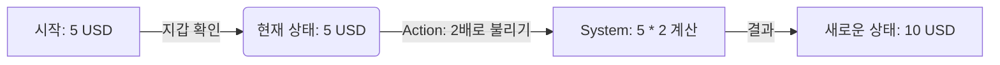

# Multi-Currency Money Calculation

## User Flow(v1.0) [SPEC-FLOW-001]



## Gherkin Scenario [SPEC-GERKIN-001]

```gherkin
Feature: Multi-Currency Money Calculation

  Scenario: 간단한 곱셈 계산
    Given 현재 지갑에 "5" "USD"가 들어있다
    When 금액을 "2"배로 불린다
    Then 결과는 "10" "USD"가 되어야 한다
```
