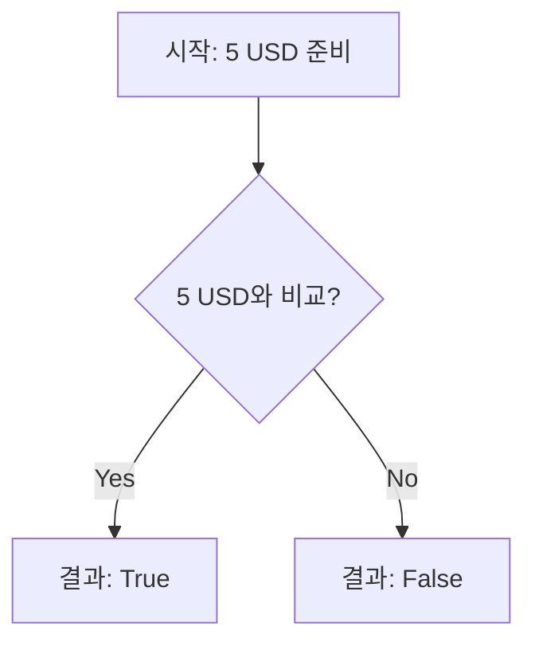

# Money Equality

## User Flow(v1.0) [SPEC-FLOW-002]



## Gherkin Scenario [SPEC-GERKIN-002]

```gherkin
Feature: Money Equality

  Scenario: 동일 통화 및 금액 비교
    Given 현재 지갑에 "5" "USD"가 들어있다
    When "5" "USD"와 비교하면
    Then 결과는 "True"여야 한다

  Scenario: 다른 금액 비교
    Given 현재 지갑에 "5" "USD"가 들어있다
    When "6" "USD"와 비교하면
    Then 결과는 "False"여야 한다
```
