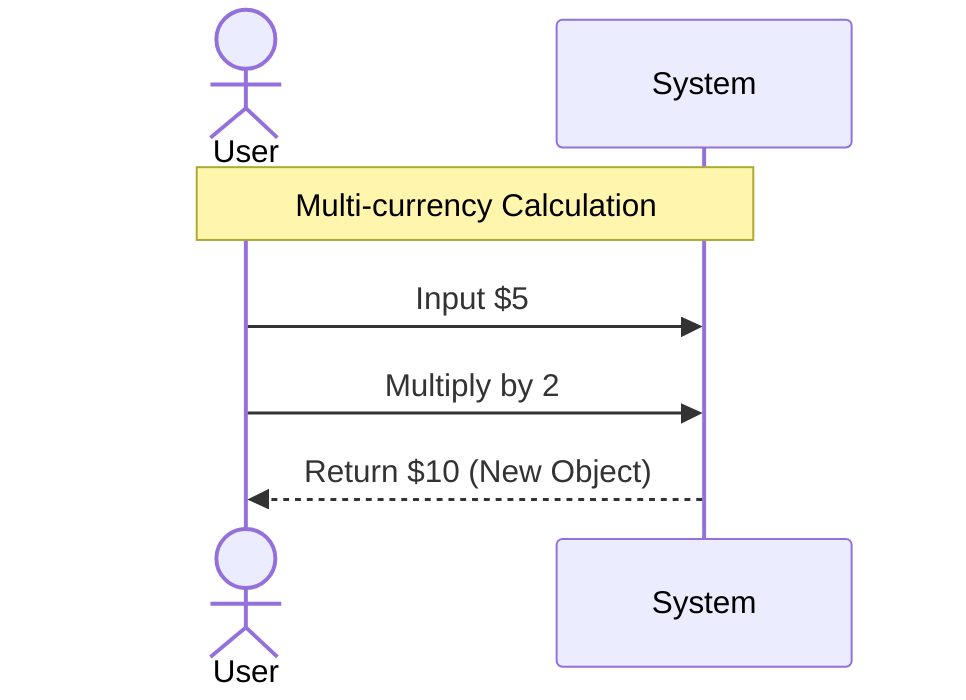
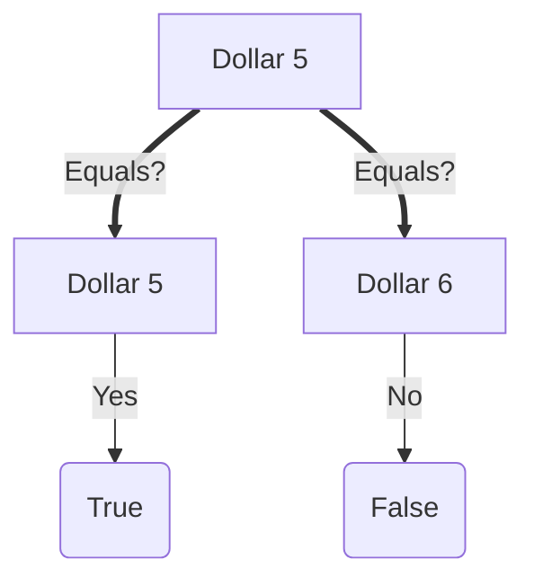

# User Flow: Money Calculation

## Goal
사용자는 통화가 다른 금액을 계산하거나, 동일한 통화의 금액을 연산(곱셈)할 수 있어야 한다.

## Flow: Simple Multiplication
**ID**: FLOW-MONEY-001
**Description**: 특정 통화의 금액에 숫자를 곱해 결과를 얻는다.

### Visualization


### Steps
1. **Input**: 사용자가 `5 USD`라는 금액을 입력한다.
2. **Action**: 사용자가 이 금액에 `2`를 곱하는 연산을 수행한다.
3. **Output**: 시스템은 결과물로 `10 USD` (새로운 객체)를 반환한다.

---

### Gherkin Specification (SPEC-MONEY-001)
```gherkin
Feature: Money Calculation
  Scenario: Multiply dollar amounts
    Given I have a "Dollar" amount of 5
    When I multiply it by 2
    Then the result should be 10 Dollars
```

---

## Flow: Value Object Equality
**ID**: FLOW-MONEY-002
**Description**: 두 금액이 실질적으로 같은 가치를 가지는지 비교한다. (Value Object)

### Visualization


### Gherkin Specification (SPEC-MONEY-002)
```gherkin
Feature: Money Equality
  Scenario: Compare two dollar amounts
    Given I have a "Dollar" amount of 5
    And I have another "Dollar" amount of 5
    Then they should be equal
    
  Scenario: Compare different dollar amounts
    Given I have a "Dollar" amount of 5
    And I have another "Dollar" amount of 6
    Then they should not be equal
```
