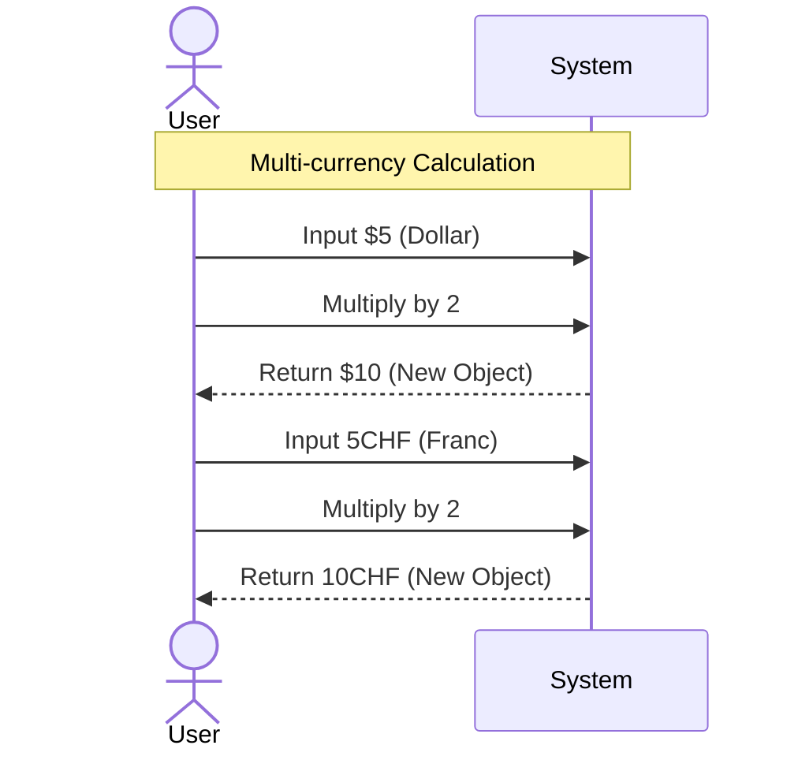
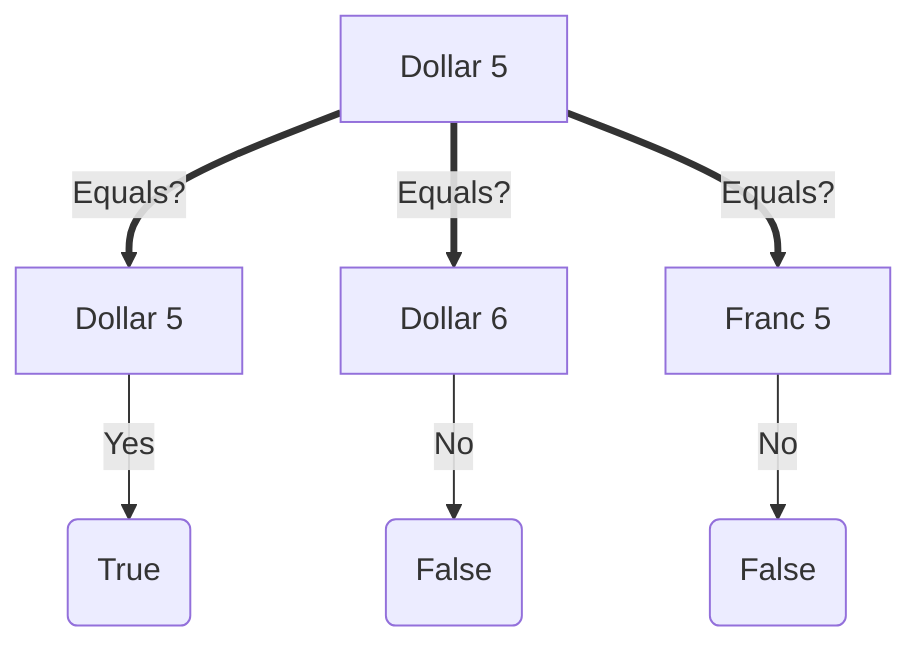
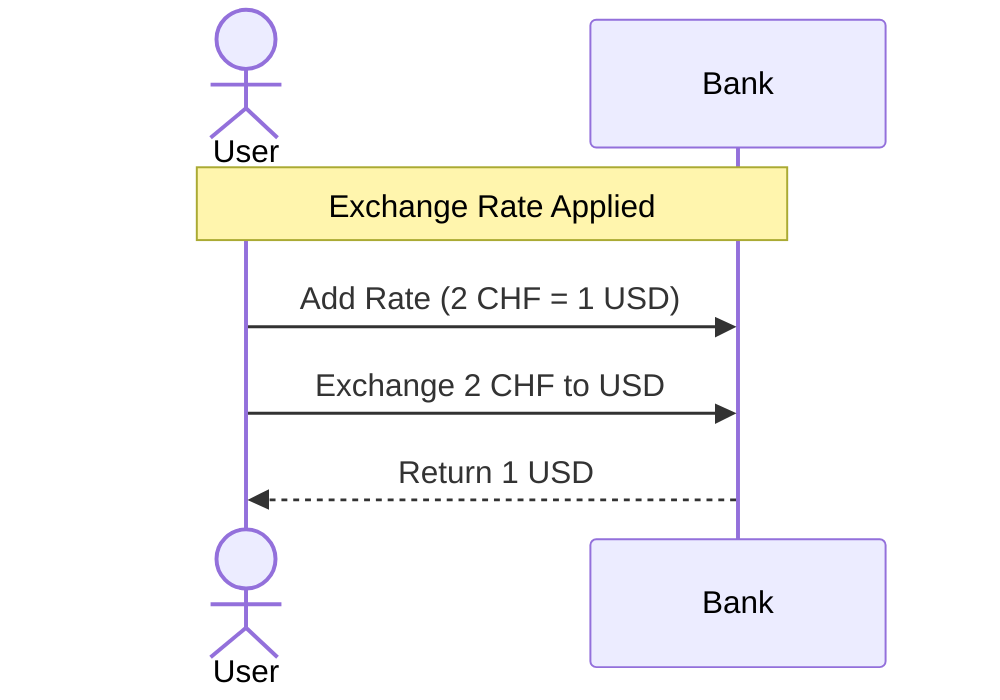
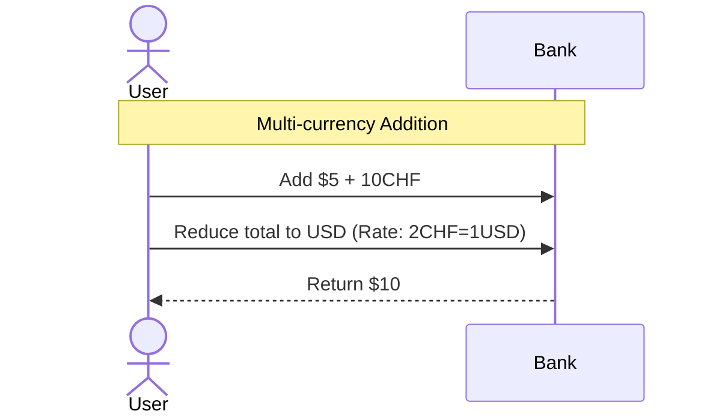

# User Flow: Money Calculation

## Goal
사용자는 서로 다른 통화(USD, CHF 등)를 사용하여 금액을 계산하고, 환율을 적용하여 변환하며, 복합 통화 연산을 수행할 수 있어야 한다.

## Flow: Simple Multiplication (Dollar/Franc)
**ID**: FLOW-MONEY-001
**Description**: 특정 통화의 금액에 숫자를 곱해 결과를 얻는다.

### Visualization


### Gherkin Specification (SPEC-MONEY-001)
```gherkin
Feature: Money Multiplication
  Scenario: Multiply dollar amounts
    Given I have a "Dollar" amount of 5
    When I multiply it by 2
    Then the result should be 10 Dollars

  Scenario: Multiply franc amounts
    Given I have a "Franc" amount of 5
    When I multiply it by 2
    Then the result should be 10 Francs
```

---

## Flow: Value Object Equality
**ID**: FLOW-MONEY-002
**Description**: 두 금액이 실질적으로 같은 가치를 가지는지 비교한다. 통화가 다르면 값이 같아도 다르다.

### Visualization


### Gherkin Specification (SPEC-MONEY-002)
```gherkin
Feature: Money Equality
  Scenario: Compare same currency and amount
    Given I have a "Dollar" amount of 5
    And I have another "Dollar" amount of 5
    Then they should be equal
    
  Scenario: Compare different amounts
    Given I have a "Dollar" amount of 5
    And I have another "Dollar" amount of 6
    Then they should not be equal

  Scenario: Compare different currencies
    Given I have a "Dollar" amount of 5
    And I have a "Franc" amount of 5
    Then they should not be equal
```

---

## Flow: Currency Conversion (Exchange Rate)
**ID**: FLOW-MONEY-003
**Description**: 환율을 적용하여 한 통화를 다른 통화로 변환한다.

### Visualization


### Gherkin Specification (SPEC-MONEY-003)
```gherkin
Feature: Currency Exchange
  Scenario: Exchange Franc to Dollar
    Given the exchange rate is 2 CHF to 1 USD
    When I exchange 2 Francs to "USD"
    Then the result should be 1 Dollar
```

---

## Flow: Multi-currency Addition
**ID**: FLOW-MONEY-004
**Description**: 서로 다른 통화의 금액을 더하여 결과를 특정 통화로 받는다.

### Visualization


### Gherkin Specification (SPEC-MONEY-004)
```gherkin
Feature: Money Addition
  Scenario: Add different currencies
    Given the exchange rate is 2 CHF to 1 USD
    And I have a "Dollar" amount of 5
    And I have a "Franc" amount of 10
    When I add them and reduce to "USD"
    Then the result should be 10 Dollars
```
